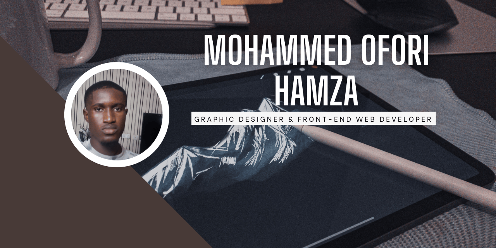

# Hi there, I'm Hamza Ofori Mohammed 👋

---

## About Me 🚀

Hi, I’m **Hamza Ofori Mohammed** 👋  
I’m a **Graphic Designer, Front-End Developer and a learner** who brings ideas to life through clean visuals and functional code.  
I design it, I code it, and I make it work (and look good too).   

- 🌱 Currently learning: **TailwindCSS, Node.js, and modern UI/UX practices**  
- 🔭 Working on: **my portfolio website and a series of creative landing pages**  
- 🤖 Exploring: **AI tools for design and web workflows (ChatGPT, MidJourney, Figma AI)**  
- ⚡ Fun fact: I see websites as “digital posters” — every pixel has a story.  
  

---

<!-- Inspiration Section -->
## 🌟 What Inspires Me  

Technology is more than just code it’s about <strong>building experiences that matter</strong>.  
I’m inspired by developers who turn abstract ideas into tools people use daily, and I’m driven by the challenge of doing the same.  

---

## My Skills 🧠  

**Front-End Development**  
  
  
  
  

**Design & Creative Tools**  
  
  
  
  

**AI & Emerging Tools**  
  
  
  
  
  

**Currently Learning**  

---
## Featured Projects 💻  

### 🚧 Coming Soon...  
Exciting projects are on the way. Stay tuned!   

---

## 📊 GitHub Stats

  

---

## 📬 Get in Touch  

  
  
  

